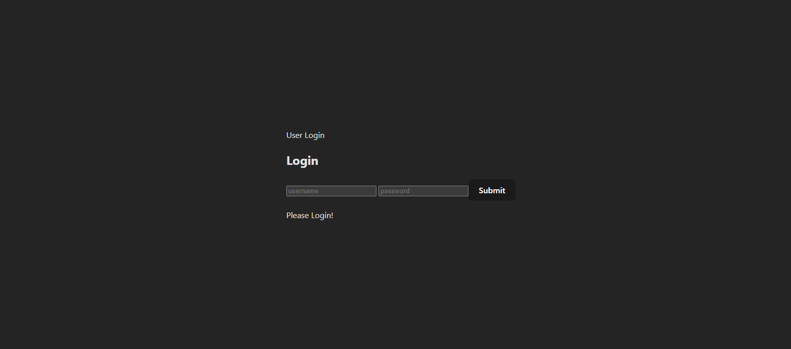

# MiniContext App

## Description
MiniContext is a React application that demonstrates the usage of React Context API. It provides a simple example of managing global state across multiple components using context.

## Components Overview
### Login Component
- Responsible for rendering a login form.
- Allows users to input their username and password.
- Updates the user context with the entered credentials upon submission.

### UserContext
- Provides a context for managing user-related data.
- Contains a user state that holds the username and password.
- Utilizes React's Context API to make the user state accessible to nested components.

## Implementation Details
- The application utilizes React's `useState` and `useContext` hooks.
- It defines a custom `UserContext` to manage user-related data.
- The `Login` component accesses and updates the user context using the `useContext` hook.
- All components within the application can access the user context and retrieve user data.

## Learnings
- Understanding of React Context API and its usage for managing global state.
- Implementation of custom context to share data across components.
- Integration of context providers and consumers within React components.

## How to Use
1. Clone the repository to your local machine.
2. Navigate to the project directory.
3. Install dependencies using `npm install`.
4. Run the application using `npm start`.
5. Access the application in your browser at `http://localhost:3000`.

## Preview

